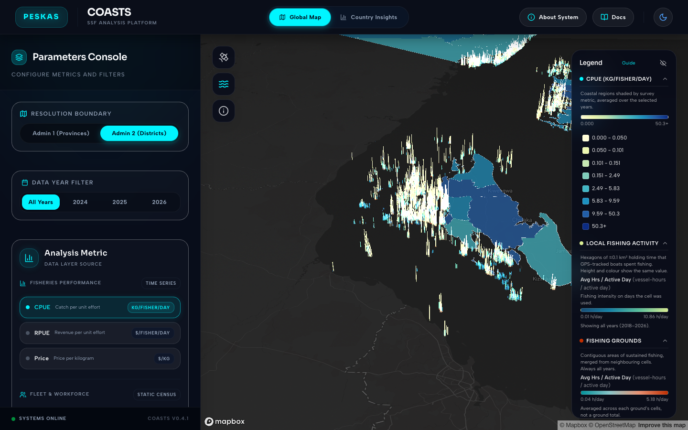

# Peskas Coasts

A map for comparing small-scale fisheries across the coastal districts of Kenya, Zanzibar (Tanzania), Mozambique and Timor-Leste.

[coasts.peskas.org](https://coasts.peskas.org)



## What it is

Peskas Coasts puts catch, revenue, fish prices, fishing effort and the number of fishers and boats side by side for coastal provinces and districts in Kenya, Zanzibar (Tanzania), Mozambique and Timor-Leste. It is for fisheries managers, policy makers, researchers, conservation groups and fishing communities who want to compare places across countries. The [country dashboards](https://zanzibar.peskas.org) and the [Timor-Leste portal](https://timor.peskas.org) look at one country in depth; Peskas Coasts compares regions across countries. It is in English and open to everyone without a login.

## What you can do

- Shade provinces or districts on the map by catch per fisher, revenue per fisher or fish price, for one year or all years.
- Click districts on the map to compare them side by side.
- See where boats with GPS trackers fish: a fine grid of fishing effort and the main fishing grounds.
- Compare the number of fishers (men and women) and boats by district and fishing gear.
- On the Country Insights page, follow a country's or district's monthly trend and compare fishing gears.
- Read how every number is produced in the [methods and data dictionary](https://coasts.peskas.org/docs).

## Where the data comes from

- **Landing surveys.** In each country, enumerators (trained data collectors) record landings at landing sites. A landing is a boat's return to shore with its catch. Each country's Peskas data pipeline turns them into monthly figures.
- **GPS trackers (Pelagic Data Systems).** Small solar-powered devices on a sample of boats record where they travel. They produce the fishing-effort grid and the fishing grounds.
- **Frame surveys.** Counts of fishers and boats by fishing gear at landing sites, for Kenya, Zanzibar and Mozambique. They come from national censuses repeated every few years, so they do not change with the year filter and are updated by hand when a new census arrives (last update: May 2026).

The [Peskas Coasts data pipeline](https://github.com/WorldFishCenter/peskas.coasts) combines all of this and converts money to US dollars. The website picks up the latest results every day.

Terms used on the map:

- **Administrative regions (GAUL)**: provinces and districts, using FAO's standard boundaries.
- **Catch per unit effort**: kilograms of catch per fisher per day.
- **Revenue per unit effort**: US dollars earned per fisher per day.
- **Price per kilogram**: US dollars per kilogram of fish.

## Who runs it

Peskas Coasts is developed and run by [WorldFish](https://worldfishcenter.org). For questions, write to <peskas.platform@gmail.com>.

## Part of Peskas

Peskas is WorldFish's open-source platform for monitoring small-scale fisheries (https://peskas.org).

- [Peskas Zanzibar](https://zanzibar.peskas.org), [Peskas Kenya](https://peskas-dashboard-kenya.vercel.app/en), [Peskas Mozambique](https://peskas-dashboard-mozambique.vercel.app): country dashboards
- [Peskas Timor-Leste](https://timor.peskas.org): Timor-Leste portal
- [Peskas Tracks](https://tracks.peskas.org): app for fishers to see their trips and log catches
- [Peskas Kenya BMU dashboard](https://digitalfisheries.kenya.peskas.org): dashboard for Beach Management Units in Kenya
- [Peskas Management Platform](https://validation.peskas.org): data review and download for survey teams
- [Peskas Fishery Data API](https://api.peskas.org/docs): programmatic access to landing data
- Data pipelines: [Kenya](https://github.com/WorldFishCenter/peskas.kenya.data.pipeline), [Zanzibar](https://github.com/WorldFishCenter/peskas.zanzibar.data.pipeline), [Mozambique](https://github.com/WorldFishCenter/peskas.mozambique.data.pipeline), [Timor-Leste](https://github.com/WorldFishCenter/peskas.timor.data.pipeline), [Coasts](https://github.com/WorldFishCenter/peskas.coasts)

## For developers

A React + Vite single-page app with no backend. It loads static JSON files from `public/data/`; nothing queries a database at runtime.

**Requirements:** Node.js 18 or later.

**Setup**

```bash
npm install
cp .env.example .env    # set VITE_MAPBOX_TOKEN; the map does not load without it
npm run dev
```

The app itself needs only `VITE_MAPBOX_TOKEN`. Anything prefixed `VITE_` is compiled into the public bundle.

**Data updates.** Two GitHub Actions workflows refresh `public/data/` every day and commit the changes to `main`:

1. `.github/workflows/fetch-mongodb-data.yml` (00:00 UTC) runs `scripts/data/fetchMongoData.js`. It reads the MongoDB collections `wio_gaul1`, `wio_gaul2`, `metrics_gaul1` and `metrics_gaul2` (region boundaries and monthly fisheries metrics, written by the `peskas.coasts` pipeline).
2. `.github/workflows/fetch-gcp-pds-data.yml` (00:15 UTC) runs `scripts/data/fetchGcpPdsData.js`. It downloads the latest fishing grounds, H3 fishing-effort and frame gears files from Google Cloud Storage.

To refresh by hand, run `node scripts/data/fetchMongoData.js` and `npm run fetch-gcp-data`. Both overwrite committed files. They read from `.env` or the environment: `MONGODB_URI` for the first; `GCP_SA_KEY` (service account JSON on one line), `GCP_BUCKET_NAME` and the optional `GCP_PDS_GROUNDS_PREFIX`, `GCP_PDS_EFFORT_PREFIX` and `GCP_PDS_FRAME_GEARS_PREFIX` for the second. In GitHub these are repository secrets; see [`.github/README.md`](.github/README.md).

**Production.** Vercel builds every push to `main` for production, so each data commit redeploys the site. Set `VITE_MAPBOX_TOKEN` and `VITE_GA_MEASUREMENT_ID` in the Vercel project's environment variables.

**Analytics.** Google Analytics 4 loads only when `VITE_GA_MEASUREMENT_ID` is set, and is skipped in development unless `VITE_GA_DEBUG=true`. Page views are sent by `usePageTracking` on each navigation, so GA4's own history-based page views must stay off: in GA4 Admin, go to Data streams, your web stream, Enhanced measurement, Page views, Show advanced settings, and clear "Page changes based on browser history events". Custom events go through `trackEvent(name, params)` in `src/lib/analytics.js`.

**Before pushing:** run `npm run lint` (it must pass with zero warnings) and `npm run qa:clarity`, which checks that metric definitions and `/docs` links are complete.

**Releases:** bump `version` in `package.json` and add a block at the top of [`NEWS.md`](NEWS.md). On every push to `main`, `.github/workflows/release.yml` tags a release from that block.

**Tests:** no automated tests yet; `npm run qa:clarity` is the only check beyond lint.

**AI-assisted work:** see [`CLAUDE.md`](CLAUDE.md).
